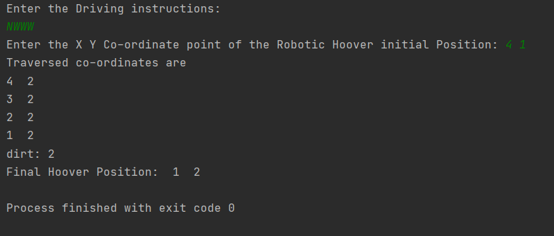

# Robotic_Hoover
Requirements  
- python3  

Instructions for deployment  
- Install Python3 on your linux
- Clone this Repo. ( # git clone https://github.com/P4v4n5/Robotic_Hoover.git )  
- Change to Robotic_Hoover directory. ( #cd Robotic_Hoover)  
- Run python file, Movement.py ( #python3 main.py)  

The above code (main.py) displays the final position of the Robotic Hoover after giving certain direction (N/S/W/E) and also the number of dirt particles on its way.  
The input values for the dirt particles are hardcoded here (dirtX, dirtY = [4, 1, 2, 3], [2, 3, 2, 3]) which means, at points (4,1)(1,3)(2,2)(3,3) the dirt particles are present.

How to give input?
- direction = input("Enter the Driving instructions \n"), here give out your instruction in the format N/S/W/E
- countEast, countNorth = list(map(int, input("Enter the X Y Co-ordinate point of the Robotic Hoover initial Position: ").split(" "))), here give the XY Co-Ordinate of the initial position of the Robotic Hover. There should be a space between X and Y Co-ordinate. Ex-Enter the X Y Co-ordinate point of the Robotic Hoover initial Position: 4 1

Output:

Here, 
